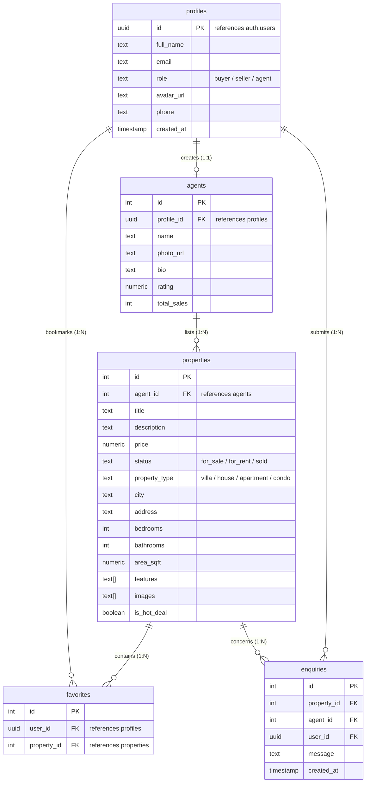

# Casa Mare Real Estate

Casa Mare is a premium, modern real estate web application built with **React**, **Vite**, **Tailwind CSS**, and fully integrated with a **Supabase (PostgreSQL)** backend for user sessions, role-based controls, row-level security, image storage, and database persistence.

---

## 🚀 How to Run the Project Locally

Follow these steps to get your local environment set up and connected to your database:

### 1. Prerequisites
Ensure you have [Node.js](https://nodejs.org/) (v16.0 or higher) installed on your system.

### 2. Install Project Dependencies
Clone the repository, open a terminal in the project directory, and install all required node modules:
```bash
npm install
```

### 3. Initialize Your Supabase Database
1. Create a free project at [supabase.com](https://supabase.com/).
2. Navigate to your project's **SQL Editor** in the Supabase Dashboard.
3. Open the [`supabase_setup.sql`](./supabase_setup.sql) file in your local workspace, copy its contents, paste them into the SQL Editor, and click **Run**.
   * *This automatically configures the database schema, seeds the initial mock properties and agents listing data, establishes security policies (RLS), and registers the database triggers.*

### 4. Create the Public Storage Bucket
1. In your Supabase Dashboard, navigate to **Storage** in the left menu.
2. Click **New Bucket** and name it exactly: `property-images`.
3. Toggle the **Public bucket** option to **ON** (so listing pictures can be read publicly).
4. Click **Save**.

### 5. Configure Your Environment Variables
Create a file named `.env` in the root of your project directory and add your unique Supabase connection details (retrieved from **Settings -> API** in the dashboard):
```env
VITE_SUPABASE_URL=https://your-project-id.supabase.co
VITE_SUPABASE_ANON_KEY=your-anon-public-api-key
```

### 6. Start the Development Server
Run the local Vite development server:
```bash
npm run dev
```
Open [http://localhost:5173](http://localhost:5173) in your browser to view the application.

---

## 🏛️ Project Architecture

The application is structured using a domain-driven layout for high modularity and ease of maintenance:

```text
casa-mare-real-estate/
├── index.html                  # HTML entry point
├── package.json                # Project dependencies and npm scripts
├── tailwind.config.js          # Design system variables (harmonious palettes, font family)
├── vite.config.js              # Vite compiler configuration
├── .env                        # Local credentials (ignored by Git)
├── .gitignore                  # Prevents secret credentials/node_modules from being pushed
├── supabase_setup.sql          # Unified script for tables, triggers, and RLS policies
└── src/
    ├── main.jsx                # Application bootstrap/mount file
    ├── App.jsx                 # App shell layout (manages Navbar, Main, and Footer)
    ├── components/             # Reusable UI component modules
    │   ├── common/             # Generic layout items (Button, Badge, Navbar, Footer)
    │   ├── property/           # Listing display components (PropertyCard, Gallery, Filters)
    │   ├── agent/              # Team profiles and inquiry elements (AgentCard, ContactForm)
    │   └── search/             # Home search header container (SearchBar)
    ├── context/                # Global React state contexts
    │   ├── AuthContext.jsx     # Manages Supabase Auth, active session listeners, and roles
    │   └── FavoritesContext.jsx# Syncs user property bookmarks with the database in real-time
    ├── hooks/                  # Custom react hooks
    │   └── useSearch.js        # Formulates async DB search queries based on search parameters
    ├── lib/                    # Client API & Connection integrations
    │   ├── supabase.js         # Supabase client instantiation file
    │   └── api.js              # Query builders, mapping adapters, and image upload controllers
    ├── pages/                  # Route level page views
    │   ├── Home/               # Home landing viewport
    │   ├── Properties/         # Search catalog and detail templates
    │   ├── Agents/             # Expert profiles and directory listing
    │   └── Auth/               # Login, Registration, and Password Reset screens
    ├── routes/                 # Routing configuration
    │   ├── index.jsx           # Declares system routes
    │   └── PrivateRoute.jsx    # Guard wrapper protecting account and listing features
    └── utils/                  # Utility helpers and layout constants
```

---

## 💾 Database Schema

The PostgreSQL schema consists of five primary tables:



---

## 🔒 Security Policies (Row Level Security)

RLS is enabled on all tables to enforce strict data constraints:

- **Properties Table:** 
  - Anyone can browse listings publicly (`SELECT`).
  - Only users with `agent` or `seller` roles can list new properties (`INSERT`).
  - Agents can only modify listings linked to their own profile (`UPDATE`).
- **Profiles Table:**
  - Users can only read and modify their own accounts (`SELECT` / `UPDATE`).
- **Favorites Table:**
  - A user has exclusive access to insert, delete, or inspect their own saved listings.
- **Enquiries Table:**
  - Anyone (including guest visitors) can submit inquiries/tour requests (`INSERT`).
  - Only the target agent receiving the enquiry can read the message (`SELECT`).
- **Agents Table:**
  - Publicly accessible to read (`SELECT`).
  - An agent can only update their own profile description and metadata (`UPDATE`).

---

## ⚙️ Trigger Automation
When a user registers an account through the signup page, a custom Postgres trigger (`handle_new_user()`) automatically hooks into `auth.users` to:
1. Mirror account identifiers and custom fields (`full_name`, `role`, `phone`) to `public.profiles`.
2. Automatically initialize a corresponding profile in `public.agents` if the chosen role is `'agent'`.
